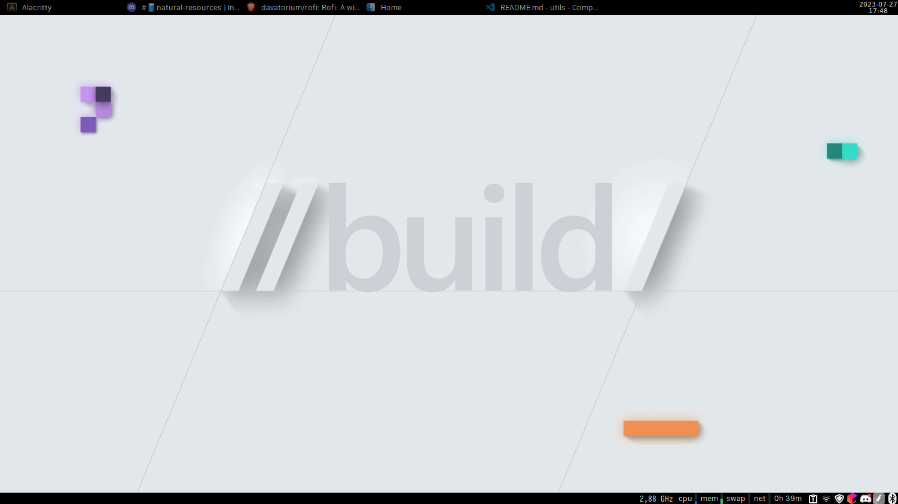

## Personal working environment.

#### Current setup:
* OS: Linux Mint 21.2
* DE: Xfce
* CPU: AMD A10-9600p (I know, it's sucks :D)
* GPU: AMD Radeon R5
* RAM: 8GB

#### Programs:
* Terminal: [Alacritty](https://alacritty.org/)
* Shell: [Starship](https://starship.rs/)
* Text Editor: [VSCode](https://code.visualstudio.com/)
* IDE: [JetBrains All Products](https://www.jetbrains.com/)
* App Launcher: [Rofi](https://github.com/davatorium/rofi)
* Office Suite: [Google Suite](https://www.google.com/intl/en_in/work/apps/business/) & [WPS Office](https://www.wps.com/)

#### Fonts:
* [JetBrains Mono](https://www.jetbrains.com/lp/mono/)
* [Iosevka](https://typeof.net/Iosevka/)
* [San Francisco](https://developer.apple.com/fonts/)

#### Screenshots:

  
   
  <i><a href="https://www.wallpaperhub.app/wallpapers/4072"><b>WallpaperHub</b></a></i>

